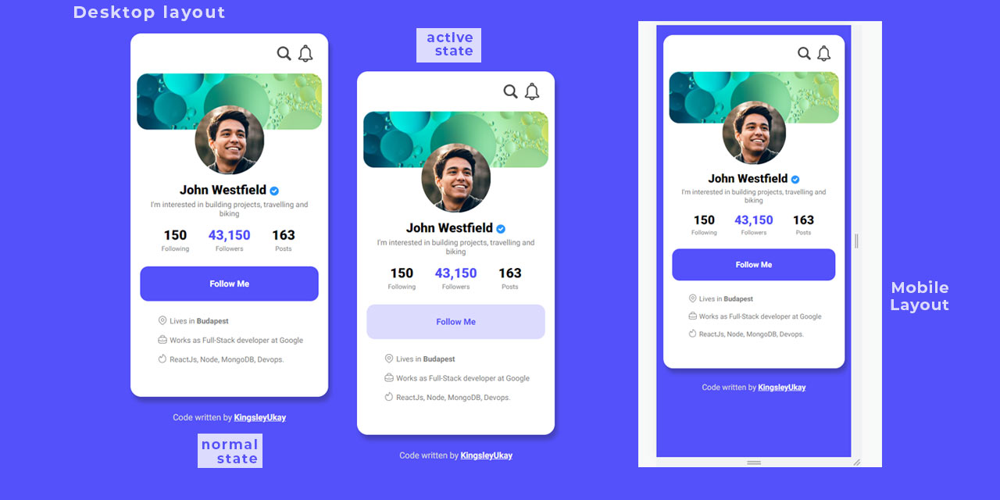

# PROFILE-WIDGET-CHALLENGE

This is a solution to the [Profile-Widget Challenge]

## Table of contents

- [Screenshot](#screenshot)
- [Links](#links)
- [Built with](#built-with)
- [What I learned](#what-i-learned)
- [Author](#author)

## Overview

### The challenge

Users should be able to:

- View the optimal layout depending on their device's screen size
- See hover states for interactive elements

### Screenshot

### Links

- Solution URL: [https://github.com/DevUKay/Profile-Widget-Challenge.git]

- Live Site URL: [https://devukay.github.io/Profile-Widget-Challenge/]

## My process

### Built with

- Semantic HTML5 markup
- CSS custom properties
- Flexbox
- Mobile-first workflow

### What I learned

Advanced CSS Properties
z-index

### Continued development

I might have not gotten this 100% correct, i am still very new at coding so i intend to keep praticing more as well as learning more advanced ways of writing code.

## Author

- Twitter - [@kingkayyy](https://twitter.com/kingkayyy)
